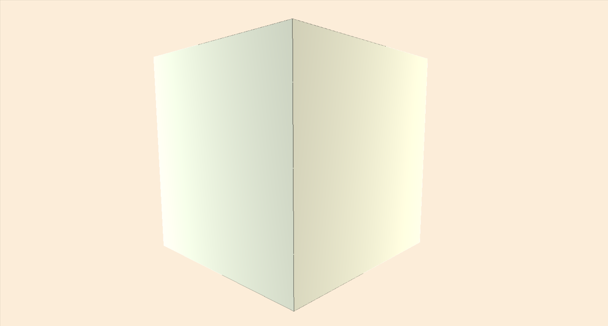

# 3D-Decomposition-Fractal
A rudimentary tool for generating walkable 3d fractals by following specified decomposition pathways at each recursion stage.
An executable can be found in the bin/Debug folder. By replacing the files in the assets folder with those of your own you can generate custom fractals. 

Two example fractal assets are included: (found in EX1 and EX2 folders under the bin/Debug folder)

EX1:

EX2:

Using OpenGL and Tao.FreeGlut/FreeGlut.

To create your own fractals, general .obj files from any 3d modeling software and rename them to numbered .txt files. Add an accompanying decomposition rule file for each model by specifying what models, rotations, and scales should replace that block after one level.
In each rule file, for each line, specify:
model# xOffset yOffset zOffset yRot \[scaleX scaleY scaleZ\]
e.g.: "2 0 0 -1 2" or "0 2 0 2 0 1 1 2"
keeping in mind +y is "up", and that the yRotation is 1 unit/90 degrees. 
